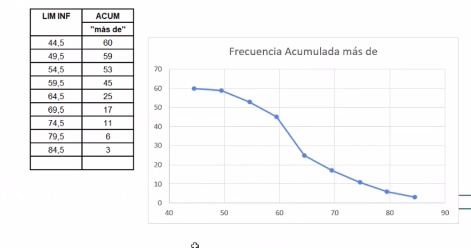
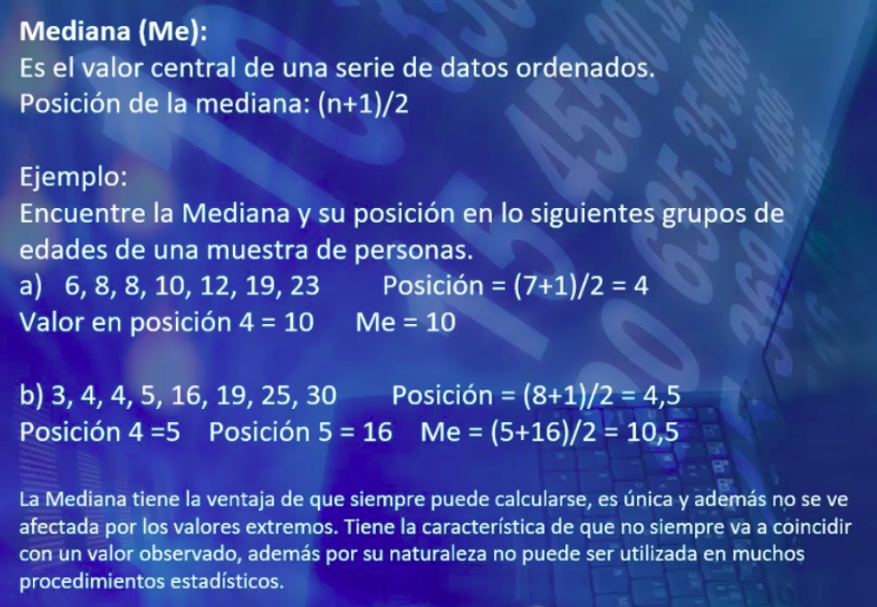

# Distribución de frecuencias

    Ordenación de datos en clases o categorias según el tipo

## Frecuencia variable discreta

    Acá se resumen los números y se agrupan por categoría

    Si queremos saber cuál es el mayor número de hermanos en un colegio 
    lo podemos ver de la siguiente manera

    La frecuencia relativa resulta de dividir la frecuencia absoluta entre
    el total por 100
     
    En gráficos de frecuencia Absoluta se debe separar bien una barra de otra
    si los números son enteros 

## Distribución de frecuencias de variable conTinua

    Continua no es presisamente variables condecimales, puenden ser enteros que se redondearon

    En las variables continuas se suelen contruir rangos y no tablas de frecuencias,
    porque casi quedaríamos con los mismos datos.

    Las clases deben ser:
    Exahustivas: el modelo de clases que creamos no debe dejar ningún valor de pesos de la tabla fuera. todos deben estar dentro de alguna de las clases. El límite inferior se contiene en la primera clase y el superior en la última, por lo que si se cumple.

    Mutuamente excluyentes: Un valor no puede pertenecer a dos clases. Si termina en 50
    no puede empezar en 50.

        Para hacer que una clase sea mutuamente excluyente podemos hacer lo siguiente:
        Tomamos el límite superior de cada una de las clases y le restamos 1.

    Una vez se cumplen las dos reglas se debe montar la distribución de frecuencias.

## Para hacer la tabla 
    ABS (Fi) es la cantidad que hay entre el LIM INDICES

    Limites Reales resultan de restarle al limite inferior de los limites de indices 0.5 y sumarlo al limite superior de cada clase.

    Apartir de los LIMITES REALES podemos sacar el punto medio (Xi) sumando ambos números del limite inferior y superior y dividiendo en 2.

### Frecuencias menos de Relativa:

    Podría decir que 49 estudiantes pesan menos de (74 kilos) y
    nos basamos en la clase que esté alineada con el número de la frecuencia ABS
    
    Calcular acumulada menos de Relativa ABS:

        Se toma el primer valor de la frecuencia absoluta
        ABS(fi).
        Luego:
        El segundo valor será sumar el anterior al segundo
        de la frecuncia absoluta ABS(fi).

    Calcular acumulada menos de RELATIVA:

        Dividir el valor de la celda ABS entre el total y multiplicado por 100. 

### Frecuencias más de:

    Podría decir que 17 estudiantes son los más pesados ya que son la suma de los  estudiantes de mayor peso(lo contrario de _menos de_)

     Calcular acumulada _más de_ ABS:
        Se inicia de abajo hacia arriba.
        Se toma el último valor de la frecuencia absoluta
        ABS(fi).
        Luego:
        El siguiente valor de abajo hacia se le sumará al último de la frecuncia absoluta ABS(fi).

    Calcular acumulada _más de_ RELATIVA:

        Dividir el valor de la celda ABS entre el total y multiplicado por 100. 

# Gráficos

## En distribucines de frecuencia se utilizan tres gráficos

    Se Utilizan los límites reales 

    Histogramas
    Poligonos de frecuencias
    Ojivas o poligonos de frecuencias acumuladas

### Histograma
    
    Gráfico de barras donde las líneas no guardan ninguna separación
    En el ancho de rango hacemos que las barras queden pegadas
    Podemos agregar un borde sólido para demarcar las barras

    A la izq del gráfico debe ir el porcentaje, se puede cambiar la serie y seleccionar la columna de ABS por RELAT

    En cada eje se debería indicar la serie (para el vertical Frecuencia relativa) Horizontal Frecuencia Absoluta

### Poligono de frecuencias

    Se grafica sobre puntos medios (xi) y las frecuencias ABS y RELAT

    Seleccionamos Gráfico de puntos unido por lineas rectas.
    
    Damos formato al eje horizontal para evitar mucho espacio en blanco.

    En el ancho de rango hacemos que las barras queden pegadas
    Podemos agregar un borde sólido para demarcar las barras

### Ojivas

    ABS o RELAT
    Se grafica con los limites superiores de cada limite real
    para las frecuencias acumuladas menos de y se grafica con los limites inferiores de los limites reales para las frecuencias acumuladas más de.

   Dar formato al eje
#### Menos de

#### Más de

#### Más de y menos de juntas

# Medidas de posición o de tendencia central

    El propósito básico de las medidas de tendencia central es resumir en un solo número el centro de
    los datos o punto central de localización de la distribución.

    Estudiaremos las siguientes medidas de tendencia central:
    1. Moda
    2. Mediana
    3. Media Aritmética

## 1. Moda
El valor que más se repite en un conjunto de datos.
Puede que hayan 2 modas o ninguna
## 2. Mediana
(n+1)/2
n = cantidad de datos ordenados de mayoo a menor en la lista
Se ordenan los datos de menor a mayor o viceversa
Buscamos el valor que está en mitad de la lista

si la cantidad es par sumamos los valores que están a la derecha e izquierda del valor obtenido y lo dividimos entre dos, el resultado será la mediana.

## 3. Media Aritmética o Promedio

x barra = Media Aritmética de una muestra una parte de la población.
µ (miu) = Media Aritmética de una población toda la población
### Media Aritmética Simple
Promedio simple
xBarra = sumatoria de x / n

### Media Aritmética Ponderada
Promedio ponderado da más importancia a ciertos valores el valor más alto modifica
µ = xBarra = sumatoria de x(w) / sumatoria de W 

# Medidas de Posición en Datos Agrupados con Distribución de frecuencias 

    La moda (Mo) basada en aproximación ABS(fi)
    Mo = Li + (d1/(d1+d2)) * c

        La clase modal es la que tiene mayor número en 
        la frecuencia absoluta ABS(fi)

        Li = Límite inferior real de la clase modal

        d1 = Diferencia entre la frecuencia absoluta de la clase modal y la clase inferior ABS de la clase modal menos ABS de la clase anterior a la modal.

        d2 = Diferencia entre la frecuencia absoluta de la clase modal y la clase posterior ABS de la clase modal menos ABS de la clase siguiente a la modal.

        c = Intervalo de la clase modal al limite superior de la clase modal le resto el menor

        Clase Modal = Clase que tiene la mayor Frecuencia Absoluta (mayor densidad)

# Mediana (Me)

    Debemos identificar en que clase está la mediana
    en base a la tabla de frecuencia absoluta ABS(fi)
    dividimos la cantidad total entre 2 y le sumamos .5
    contamos las cantidades de la ABS hasta llegar a la clase donde esté la clase que contenga la cantidad que resultó de la mediana

    Me = Li +[(n/2-fa)/fi] * c

    n = Número de observaciones (cantidad de la lista)

    Li = Límite inferior real de la clase donde está la mediana, o sea donde se alcanza la frecuencia
    acumulada “menos de” (n+1)/2 

    fi = Frecuencia absoluta de la clase donde está la mediana (Para buscar la mediana vamos a la ABS menos de después de tener Li ) y buscamos desde el inicio hasta llegar a lugar donde encontremo un valor igual o que contenga el valor de Li

    Fa = Frecuencia Acumulada “menos de” de la clase anterior a la clase donde está la medina

    c = intervalo de la clase donde está la mediana

# La Media Aritmética

    xBarra = [(sumatoria de x*f)/sumatoria de F]

# Fórmulas Estadísticas Excel 

https://youtu.be/M9Wt0lccHkA?t=961

# Medidas de variabilidad o Dispersión

    Perite conocer que tan alejados se encuentran los datos unos de otros
## Recorrido o amplitud

    Restamos al valor mayor el menor y ese sería el Recorrido.

## Desviación media DM
    
    Busca un promedio de las diferencias
    Promedio grande diferencias grandes, promedio pequeño
    diferencia mínimas

## Varianza y Desviación Datos Sin Agrupar
    
    N es el total de población.
    n es la población de la muestra.
    Puede ser para muetra o población.

    Calcular diferencias de cada dato con respecto al promedio.

    

## Varianza y Desviación Datos Agrupados
    
    N es el total de población.
    n es la población de la muestra.
    Puede ser para muetra o población.

    Calcular diferencias de cada dato con respecto al promedio.

    En la varianza restamos el punto medio al promedio xRalla

    El promedio en datos agrupados es la sumatoria de la multiplicación del punto medio por las frecuencias absolutas xi*fi entre la cantidad total.
    
    A cada punto medio se le resta el promedio

    

## Coeficiente de Variación

    Desviación estándar/promedio
    Es una medida de variabilidad relativa.

    Comparar diferentes poblaciones o muestras.

# Cuantilios

    Datos ordenados de menor a mayor.
    Son medidas de posición.

    Si tengo datos ordenados de menor a mayor, puedo averiguar si un dato esta dentro del 10% 20%

    Permite identificar la posición que toma un valor. 

    Entre ellos están las mediana y cuartiles, el cuartil dos es mediana 
    También están los deciles

## Cuartiles
    
    Los cuartiles se acomodan de tal manera que cada uno represente el 25% de los datos el Q1 va a tener el 25% de los datos a la izq

## Deciles
    
    El decil 1 representa el 10% de los datos a la iz el 2 el 20% y así sucesivamente.

## Percentiles

    Buscar en que posición está el valor que busco.

    Datos que representan 1% a la izquierda

    El decil 9 representaría 9% a la derecha y 91 a la derecha.

## Fórmulas para encontrar las posiciones

## Buscar un percentil exacto

    La fórmula es
    P(#De percentil a buscar) = (#Percentil a buscar/100) * (60+1).

    Si no encontramos el valor exacto:
        creamos una tabla donde:
            Termino | Valor
            Colocaremos el percentil anterior | el valor de ese percentil.
            Percentil resultado de la fórmula del percentil. | Pm Para representar el valor del percentil que andamos búscando.
            Siguiente percentil después del resultado de la fórmula del percentil | valor de ese percentil.
    Una vez creada a tabla podemos aplicar la fórmula:

#    Si nos piden cuartiles o deciles sólo buscamos la fórmula y la sustituimos por la de percentil y el proceso es igual

# Fórmulas para datos no agrupados

    https://youtu.be/7XzjP3HocNI?t=863